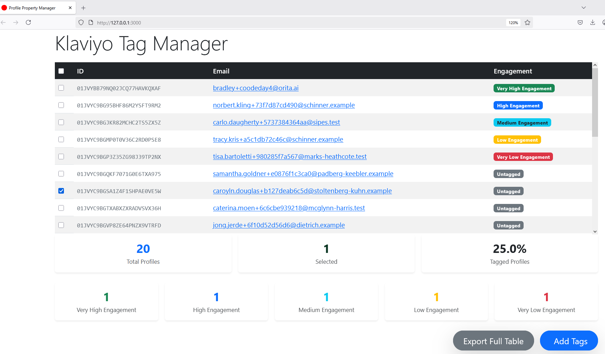
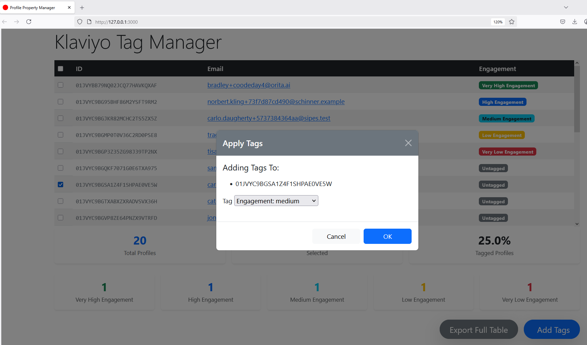

# 📄 Overview

This is a full-stack Rails 8 application designed to integrate with **Klaviyo**, one of Orita's core platforms. The app allows users to manage customer profile engagement tags through a clean interface built entirely within Rails using Hotwire (Turbo + Stimulus) for reactive, single-page behavior.

The app connects to a provided Klaviyo account (seeded with test data) via a private API key and syncs profile data for interaction and modification.

---

## 🚀 Tech Stack

- **Framework**: Ruby 3.3.1 on Rails 8.0.2 (monolith)
    
- **Frontend**: Hotwire (Turbo + Stimulus), Bootstrap CSS
    
- **API Integration**: Klaviyo REST API v2023-10-15
---

## ⚙️ Features

- 🔄 **Ingest profiles** from Klaviyo
    
- 🧍 **List profiles** with id, email, name, and current engagement level
    
- ✅ **Select multiple profiles**
    
- 🏷️ **Assign engagement tags**:
    
    - `very high`
        
    - `high`
        
    - `medium`
        
    - `low`
        
    - `very low`
        
- 🔁 **Push updates** to the Klaviyo API with one click

## 🧮 Dynamic Dashboard

- Metric Smart Cards
- Select All Checkbox 
- mailto link for all emails
- Engagement Tag Badges
- Full Table Export Button
- Id List for Tag Update on Modal
---

## 🛠️ Setup & Installation

### 1. Clone the repo

```bash
git clone https://github.com/ulricscott/profile-property-manager.git
cd profile-property-manager
```

### 2. Setup environment variables

Add your Klaviyo API key to `config/initializers/klaviyo.rb`:

```ruby
KlaviyoAPI.configure do |config|
  config.api_key["Klaviyo-API-Key"] = "Klaviyo-API-Key COPY_AND_PASTE_API_KEY_HERE"
end

```
⚠️ Important: Keep the "Klaviyo-API-Key " prefix before your actual API key to avoid 401 errors.

### 3. Install dependencies

```bash
bundle install
```

### 4. Run the app

```bash
bin/dev
```

This uses Rails’ new `bin/dev` to concurrently start the web and asset servers.

### 5. Troubleshooting

- **401 Error**: Ensure your API key includes the `"Klaviyo-API-Key "` prefix
- **Missing profiles**: Check that your Klaviyo account has test data
- **Tests failing**: Run `bundle exec rspec --format documentation` for detailed output

---
## 📸 Demo

*Main dashboard showing profile management interface*


*Main dashboard showing add tags modal*

## 📊 Usage

- Visit the homepage or root to view synced profiles
    
- Use checkboxes to select one or more profiles
    
- Click the "Add Tags" button to open a modal
    
- Select a tag from modal dropdown and click "OK" submit update

---

## 🧠 Design Decisions

- **Monolith Architecture**: Simplifies deployment, testing, and delivery
    
- **Hotwire/Turbo**: Enables a modern, fast UX without a React frontend
    
- **SDK Setup**: Initializer necessary for authentication and connection setup
    
- **Tagging**: Updates Klaviyo API with engagements
    
- **Stimulus Controllers**: Handle modal toggling and submission events
    

---

## 📌 Known Limitations

- The app currently assumes API stability with Klaviyo and no pagination
    
- Error handling is basic and would benefit from additional user-friendly alerts
    
- Dashboard does not yet support advanced filtering or search

- Current Export functionality is limited to all profiles and defaults to .csv format

- Dashboard Controller renders the view instead of returning JSON

- Current submission of modal refreshes the page instead of re-pulling the table

    

---

## 🧪 Testing

- Run all tests:
    

```bash
bundle exec rspec
```

- Feature specs using Capybara simulate full user interaction
    

---

## ✅ Future Improvements

- Add support for paginated API responses from Klaviyo
    
- Improve UI/UX with modals and confirmation toasts
    
- Implement background jobs (e.g., Sidekiq) for large syncs or updates
    
- Secure API usage further via encrypted credentials
    

---

## 🙌 Final Thoughts

This application demonstrates a full-stack Rails 8 implementation with third-party API integration, and clear separation of responsibilities—making it scalable, performant, and easy to extend.

---

